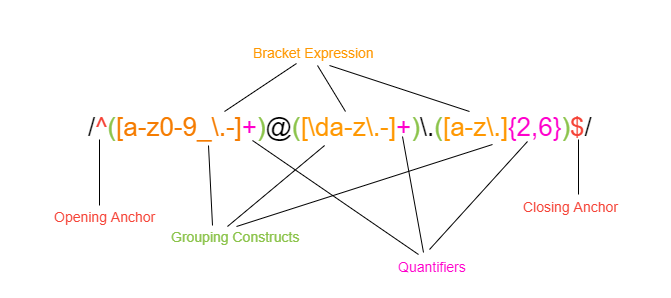

# Regex - Matching an Email

A **"Regex"** stands for **Regular Expression** and is a string of specific characters which allows us to search for specific patterns of text within string. This patterns are a universal and powerful tool as they are used to validate text and/or search through text and can be used in more than one language such as Python, JavsScript and C++.
When you first look at a regular expression it can look extremely complicated, this is because there are endless possible combinations to describe a string and it takes practice to fully understand the syntax.

This specific tutorial will explain the regular expression of "Matching an email"

## Summary

A possible Regular Expression to describe whether a text or input matches the email format is:

```
/^([a-z0-9_\.-]+)@([\da-z\.-]+)\.([a-z\.]{2,6})$/
```

This specifc sequence of characters is used to validate if an email corresponds with the classic email format. Here is a breakdown of the Regex components which are explained in detail below:

* `/..../` Indicates a regular expression
* `^` and `$` are anchors and initiate the beginning and end of the Regex
* `a-z` Represents any lower case alphabetic character from a to z
* `0-9` Represents any numeric character from 0 to 9
* `_` Matches the literal character "_"
* `-` Matches the literal character "-"
* `@` Matches the special character "@"
* `.` Outside of brackets it matches the literal character ".", inside it can be any character (except newline)


## Table of Contents

- [Anchors](#anchors)
- [Quantifiers](#quantifiers)
- [Grouping Constructs](#grouping-constructs)
- [Bracket Expressions](#bracket-expressions)
- [Character Classes](#character-classes)
- [The OR Operator](#the-or-operator)
- [Flags](#flags)
- [Character Escapes](#character-escapes)

## Regex Components

As **Regex** is considered a literal, we can wrap the expression in forward slash (`/`) characters: 

`/`^([a-z0-9_\.-]+)@([\da-z\.-]+)\.([a-z\.]{2,6})$`/`

**Note**: In JavaScript there are two ways of describing a Regex: The literal notation and the use of a constructor notation where the constructors functions parameters are wrapped in quotation marks instead of forward slashes.

```
let re = /\w+/                  //literal notation
let re = new RegExp('\\w+')     //constructor with string pattern
```



### Metacharacters and literal characters

In regular expressions there are different types of characters. In order to understand the "Match an email" regex the following should be outlined:

* **Literal character**: In literal characters search a character matches a character. This is very simple concept, so for example `C` matches `C` in `Cars`, or `e` matches `e` in `pen`.

* **Metacharacters**: Basic metacharacters have a special meaning and they can not be used as a single literal character alone. For example a `?` can not be used alone without getting an error or unexpected result. If you want to use a questionmark as an actual character you have to use `\?` instead of `?`, this can be called **escaping a metacharacter**. (See further details in the "Character Escapes" section)

### Character Escapes

As mentioned above there are some metacharacters which have a special meaning so they can not be used as an actual character by itself. For example the `?`-character is a quantifier, so if we only use it by itself, when we actally want to look for a questionmark in a string, it won't work. The solution for this problem is to use a backslash (`\`) before the special character. This concept is called "escaping a character". So basically by using the backslash before a metacharacter with a special meaning, this character loses its meaning and becomes an ordinary special character. 

All the following characters have special meaning within a regular expression:

```
. ^ $ * + - ? ( ) [ ] { } \ | — /
```

To understand the "Matching an email" regex it is mendatory to understand this concept. As we can see, the dot (period) is one of the characters with a special meaning and purpose. It can be used as a "wildcard" because by default, the dot is a metacharacter which can match any single character(except a newline). It can be used as a letter, digit, whitespace or special character. 

For example: `...\.` this could match many different strings such as: `cat.`, `891.`, `?=+.` because the dot (.) can be anything. 

What if we want to specifically find a dot instead of any character? We  can use the "escaping" concept which means that the dot is not defined as any character anymore, in fact it is now "just" a dot (`.`).

Example:

 * `alert("5.1".match(/\d\.\d/))` = MATCH, because `\d` is any digit and `\.` is a dot, so `\d\.\d` is the same as `5.1`
 * `alert("51".match(/\d\.\d/))` = NO MATCH, because the expression is looking for a real dot but the string does not contain one.


In the "Match an email" example we use the "escaping concept four times:

/^([a-z0-9_`\.`-]+)@([\da-z`\.`-]+)`\.`([a-z`\.`]{2,6})$/

### Anchors

In a regular expression line anchors do not match any characters in the text. In fact they are used to match the position before and after characters. To indicate the beginning of a regular expression we use `^`, so every character that follows is considered as being part of the pattern we are looking for. To determine the end of the expression we use `$`:

/`^`([a-z0-9_\.-]+)@([\da-z\.-]+)\.([a-z\.]{2,6})`$`/


In general there are two possible options the string could start or end with:

 1. The beginning or end could match an exact string. E.g. If the regex would be `^user` this means that the text needs to start with `user`. If the text starts with `User`, it would not match as a regular expression because it is case sensitive.
 2. The start or end of the string can have multiple possible matches, if we use a bracket expression. (See bracket expressions below)

If we take a look at the email regex we can see the anchors at the beginning and end of the string. This defines that the beginning of the regex can start with any lower case letter, any number from 0 to 9 or any out of (`_`, `.` or `-`) special characters. If the would start the email with `?test@user.com`, it would not match the regex and thorw an error.
As we also use a bracket expression at the end of the string we text must end with a combination of charaters which match this pattern: `[a-z\.]{2,6}`.


### Bracket Expressions

A bracket expression is a subexpression of the regex string. The sequence of characters inside of the brackets (`[]`) represent the scope and outlines the characters we want to include in order to find a match.
It is very common to use a hyphen (`-`) between letters or numbers to describe the range of characters which we are looking for. It is sort of a shortcut of writing the exprssion. E.g. `[abcde]` is the same as `[a-e]` or `[12345]` is the same as `[1-5]`.

In our specific case of the "Match an email" Regex we have three bracket expression: 

1. `[a-z0-9_\.-]` The string can contain any lower case letter, any number from 0 to 9 or can contain special characters such as the hyphen (`-`), an underscore (`_`) or a dot (`.`). As this bracket expression follows right after the `^` anchor, it means that the beginning of the string we want to match must start with any of the above named characters. It is also important to understand that it is not mendatory that all characters are present at the same time. So possible options would be: `test-12`, `user_test`, `user`, `12user_`. Also note that for example `User_12` would not match our pattern as only lower case letters are valid in the string, so in order to make this valid we would need to change the bracket expression to: `[a-zA-Z0-9_\.-]`
2. `[\da-z\.-]` This subexpression contains different character classes (Read below for further explanation). It means that after the @ literal character the domain name can contain any lower case alphabetic number, any digit character and/or a dot (`.`) or `-`. 
3. `[a-z\.]` This bracket expression is the last item of the string and it can contain any lower case alphabetic letter and/or a dot (`.`)


### Quantifiers

As we now know how to define the content of a string we should also take a look on how to define the amount/length of characters the text must contain.
To determine the length of the whole text or of a specific section (e.g. Bracket Expressions) we can use "Quantifiers" which set the limit of minimum and/or maximum amount of characters.

Most common quantifiers:

* `*` The quantifier matches the perceding element zero or more times. This is equivalent to `{0,}`
* `+` Match one or more time. This is equivalent to `{1,}`
* `?` Match zero or one time. This is equivalent to `{0, 1}`
* `{n}` Match n times
* `{n,}` Match n or more times
* `{n, m}` Match from n to m times

In a regex we can differe between "greedy" and "lazy" qunatifiers:

 * **Greedy Quantifier**: All the above named quantifiers are greedy quantifiers and it is possible to have a "lazy" version of those. A greedy quantifier tries to match an element as many times as possible. So when using a greedy qunatifier the regex engine goes through every character of the string and adds as many as it can to the match. If a part of the pattern does not fit it goes backwards by one character until it matches the pattern we are looking for. So overall, the greedy mode tries to match as many characters as possible, only giving back as much as necessary

 * **Lazy Quantifier**: In order to turn a greedy quantifier into a lazy one, we can simply add a `?` to our expression (e.g. `+?`). This is the opposite to the greedy mode as it tries to repeat the steps a minimal number of times. Overall, the regex engine repeats the steps as less as possible until it finds the right pattern.

To summarize the greedy qunatifier tries to match as much as they can only giving back as much as necessary to match the remainder of the regex, while the lazy qunatifiers tries to minimal match first and increases if necessesary.


In the "Match an email" regex example we use two greedy qunatifier: The `+` and `{2,6}`.

* [a-z0-9_\.-]`+` This expression addresses the username/name at the beginning of the email and its length must be one or more characters in order to match the email format.

* [\da-z\.-]`+` This expression addresses the domain of the email and also means that the character length of the perceding item must match one ore more time.

* [a-z\.]`{2,6}` This expression means that we want to find the perceding item a minimum of two times and a maximum of six times. (E.g. `.com` matches while `.comcom` does not match, because the amount of characters = 7 )


### Grouping Constructs

To describe a grouping of characters in a regex they are placed within parentheses `()` and is used to restrict alternations. We use the parentheses to enclose a pattern as it allows us to get a part of the match as a seperate item/subexpression. This is a very powerful tool because we can refer to the groups whenever we like as the regex engine captures them as a single unit. When a regex gets more complicated, by grouping parts of the regex in subexpressions we are able to check if different sections match different requirements and it is easier to apply validations to each section of the string.

In our example the grouping of the characters allows us to apply seperate string rules to each such as the qunatifiers. The email regex contains three grouping constructs:

 * `([a-z0-9_\.-]+)` This subexpression will determine whether the username matches the pattern or not. 
 * `([\da-z\.-]+)` This subexpression will validate if the email domain name matches the pattern
 * `([a-z\.]{2,6})` This construct will validate the remaining domain name such as `.com`, `.net` or `.co`

Because of the grouping construct we re able to apply different quantifier rules to different subexpressions.
 

### Character Classes

Character classes are special notations which match any symbol from certain set. We already know the bracket expressions which are considered character classes. But there are also some other common character classes which can be indicated by a backslash `\` character. Certain letters can be escaped by representing common character classes, such as words, whitespaces or digits.Some examples of character classes are:
 
 * `.` - Matches any character excet a newline character
 * `\d` - this is a digit character class and matches any single digit(arabic) and is equivalent to the bracket expression `[0-9]`
 * `\s` - match a whitespace symbol such a space, a tab (\t), a newline (\n), etc.
 * `\w` - w stands for word character. It matches the ASCII character [A-Za-z0-9_] and matches any alphanumeric from th elatin alphabet plus an underscore `(_)`

For example: The expression `/\w\d/g` (g looks for all characters, not only the first one) matches any word followed by a digit such as `test12`

**Note**: `\d`, `\w` and `\s` can be changed to perform a negative match by capitalizing the letter character. For example, \D matches a non-digit character.

In the "Match an email" Regex there are multiple character classes to ensure that the subexpressions match a larger set of characters: 

1. `[a-z]` Matches any lower case alphabetic character between a and z
2. `[0-9]` Matches any number between 0 and 9
3. `\d` Matches any digit character
4. `.` Matches any chracter except a newline character


### The OR Operator

The **OR operator** allows us to create a logical "or" operation. As we learned before, a bracket expression does not require a string to match all characters included in the pattern. Taking the example of `[a-z0-9]`, the text can include alphabetic **and** numeric characters but it is not mandatory. The text could also contain only alphabetic or numeric characters. To achieve a similar logic outside of the bracket expression, for example in a grouping construct, we could use the pipe character (`|`). The pipe character is used to match characters or expressions of either the left or the right of the | operator. For example `(t|T)` will either match `t` or `T`, it can't match both, and is equivalent to `[tT]`.

**Note**: As there is no "OR operator" used in the "Match an email" regex, this is not relevant for this specific case.


### Flags

Flags in regular expressions are located after the closing forward slash (e.g. `/pattern/g`) and define extra functionality or limits for the regex. They are optional tokens which can be used to modify the searching behaviour of given patterns. Each flag is denoted by a single alphabetic character and serves different purposes in modifying the regex searching behaviour. There are six possible flags:

* `i` - Stands for "ignore casing" and does the job of carrying out a case-insensitive search: There is no difference between `a` and `A`
* `g` - With this flag the search looks for all matches ("global"), without it – only the first match is returned
* `m` - Multiline mode: Makes the anchors match the beginning and ending of every single line instead of the beginning and ending of the whole string
* `s` - Enables “dot all” mode, that allows a dot `.` to match newline character \n 
* `u` - Enables full Unicode support: Makes the expression assume individual characters as code points, not code units, and thus match 32-bit characters as well.
* `y` - “Sticky” mode: Searching at the exact position in the text (index) indicated in its lastIndex property

**Note**: As there are no flags used in the "Match an email" regex, this is not relevant for this specific case.


## Author

Author: Zahra Mertens

The author is currently studying web development at the University of Sydney. Check out the [portfolio](https://zahramertens.github.io/SupMaPortfolio/) or [github profile](https://github.com/ZahraMertens) for further information.
